# Timines-crêpes-webapp

## Table des matières
- [Introduction](#introduction)
- [Prérequis](#prérequis)
- [Fonctionnalités](#fonctionnalités)
- [Screenshots](#screenshots)
- [Licence](#licence)

## Introduction
Cette application a été conçue et utilisé dans le cadre de la campagne BDE de la liste Timines Travel 
aujourd'hui actuel BDE de l'École des Mines de Saint-Étienne ISMIN pour le mandat 2023/2024.
Elle remplissait une double fonction : 
  - Partager les infos concernant les événements organisé par la liste
  - Gérer les commandes et les livraisons de crêpes

## Prérequis
- Python3.10
- Django
```bash
pip install django
pip install django-webpush
```

## Fonctionnalités
* La web app nous permet de publier facilement des infos sur des évenements pusique le contenu de l'app est généré de façon dynamique. 
* Les utilisateurs peuvent aussi s'abboner à des notification par feed RSS pour être mis à jour de tout changeemnt
* Le backend donne accès aux memebres de la liste à un dashboard admin pour modifier le contenu du site rapidement mais surtout pour suivre en temps
réel les commande de crêpes et pouvoir livrer dans les plus brefs delais. Pour des questions de sécurité le chemin pour l'admin à ete modifié, le
dashboard se trouve :
```bash
http://127.0.0.1:8000/erbich12
```
<p align="center">
  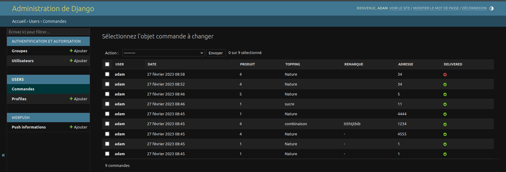
</p>

## Screenshots
<p align="center">
  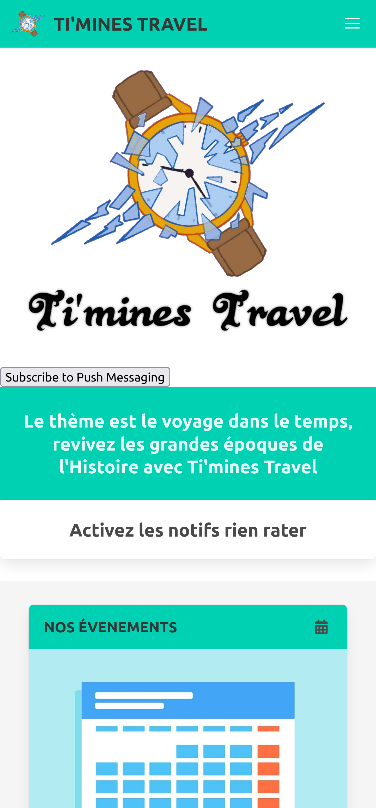
  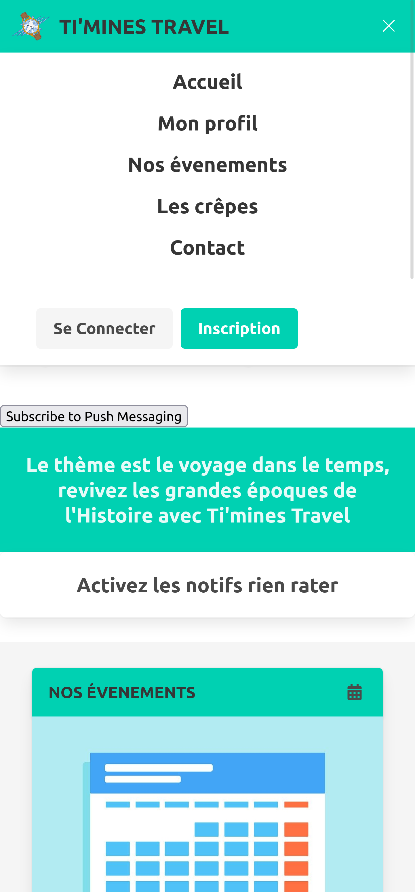
  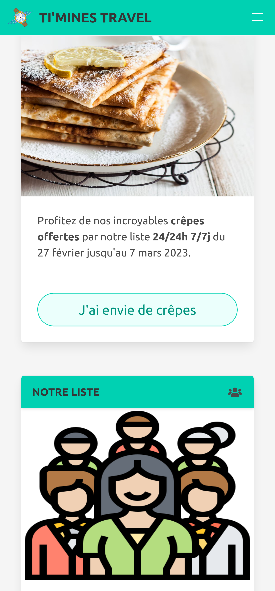
</p>

<p align="center">
  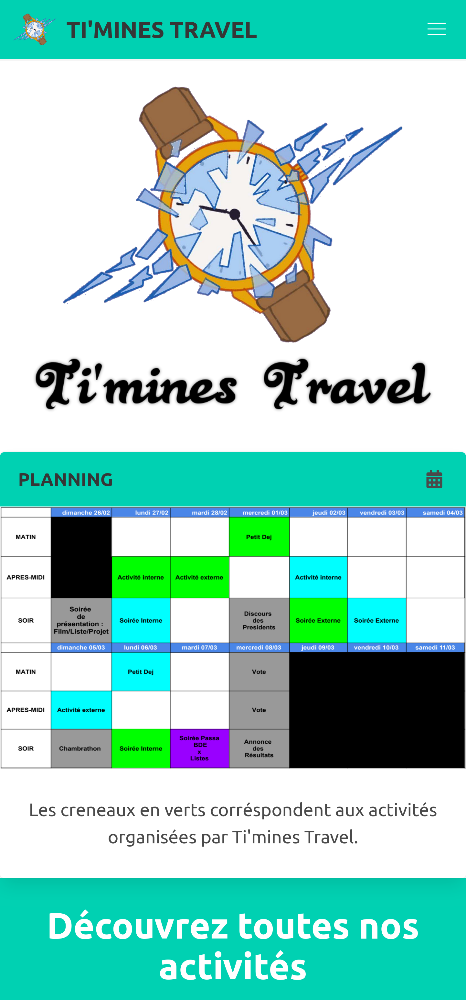
  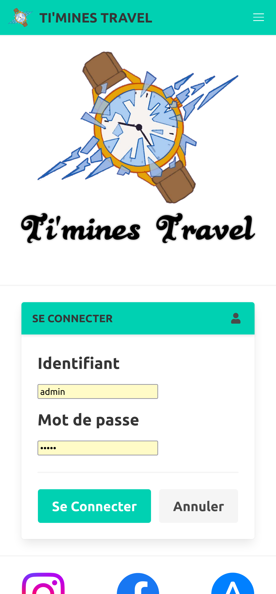
  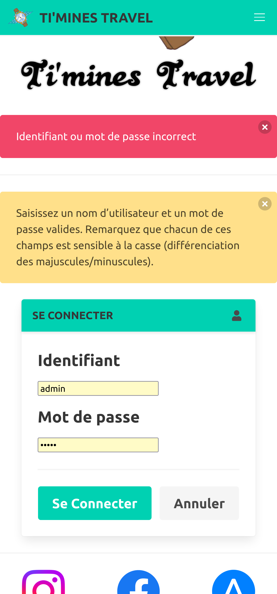
</p>

<p align="center">
  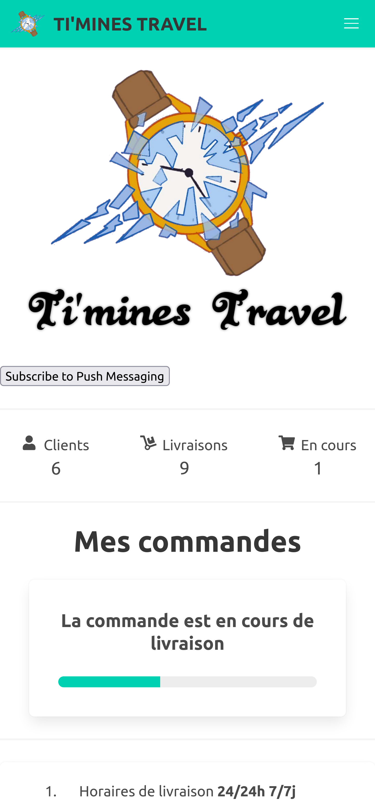
  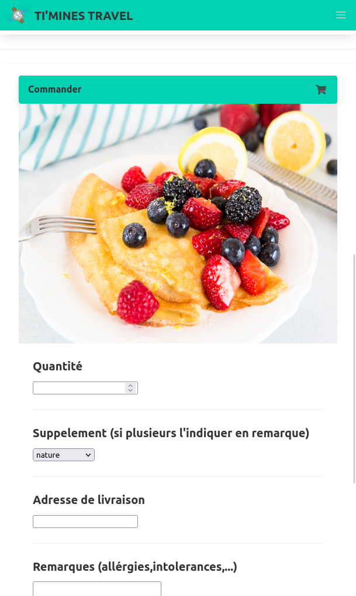
  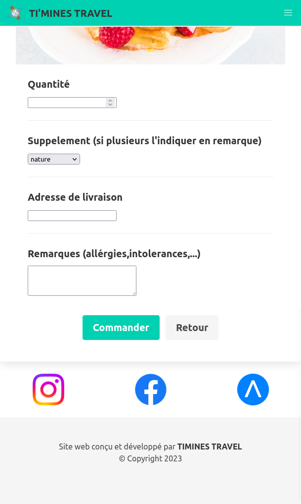
</p>

<p align="center">
  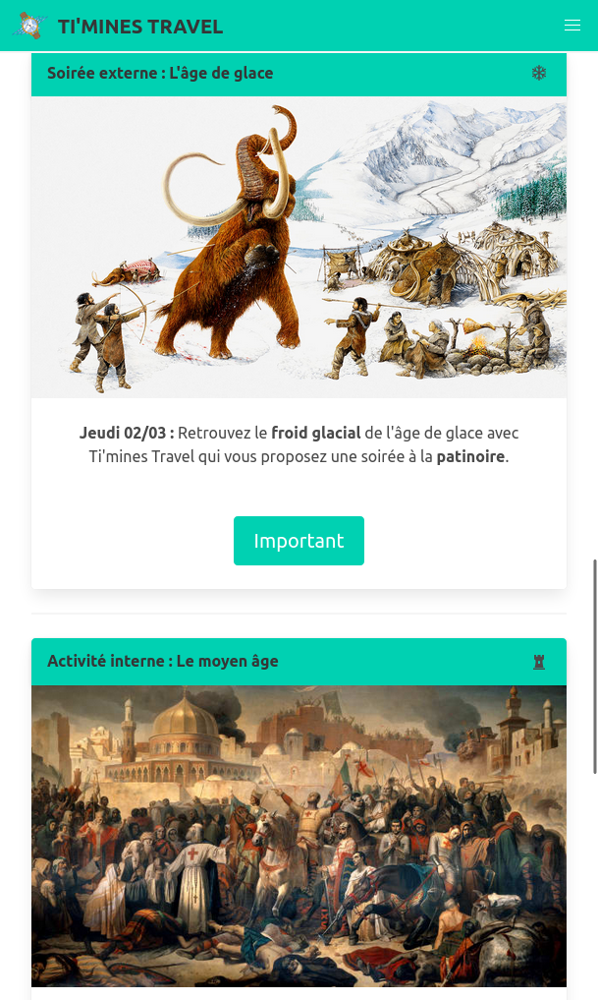
</p>


## License
[MIT License](LICENSE)

